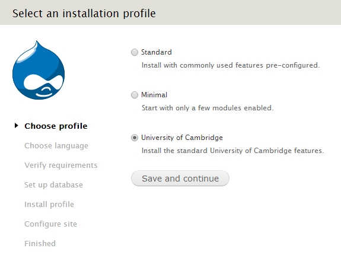

University of Cambridge install profile
=======================================

This install profile contains everything required for a University of Cambridge Drupal site (such as the University's house style and Raven authentication), and includes a variety of modules commonly used (such as Workbench, Media and CKEditor). Some modules are pre-configured, others are bundled; important patches are also applied to some modules where there hasn't been a new stable release.

Installing a new Drupal site
----------------------------

In a fresh copy of Drupal extract the contents of this profile to `/profiles/cambridge/`, then follow the normal Drupal installation process. On the first screen you will see the option to use the Cambridge install profile:

(If you have an existing site, presumably using one of Drupal's bundled install profiles, and would like to switch to this install profile, you can [Google how to do it](https://www.google.co.uk/search?q=drupal+switching+install+profiles). It won't configure the site, but can be useful if you would like to use the modules provided by the profile.)

Updating the profile
--------------------

New versions of the profile will be released every couple of months (sooner if there are security fixes), containing updates to modules (including patches), as well as new modules/functionality.

When updating the profile, replace the whole contents of the `/profiles/cambridge/` folder then run Drupal's update process.

You shouldn't normally make changes to the `/profiles/cambridge/` folder (including trying to updates profile-provided modules through Drupal's update manager), as you may run into problems trying to update the profile in the future.

If you do need a different version of a module to what the profile provides, however, you can override it by placing your version in your site's folder (so one of `/sites/all/modules/`, `/sites/default/modules/` or `/sites/www.mysite.cam.ac.uk/modules/`). When the profile is updated to include the new version you should then remove your override and let Drupal revert back to using the profile's version.

List of currently included modules
----------------------------------

There have been requests in earlier versions of the Profile for a full list of supported / included modules in the Profile, so with the release of version 1.7 we are now including this. The list of included modules is as follows:

Contributed Modules (Updated for Profile 2.6)
-------------------

Admin Menu
Admin Views
Advanced Help
Auto Entity Label
Block Title Link
Calendar
CKEditor
CKEditor Link
Context
Crazy Egg
CSS Injector
CTools
Date
Delta
Devel
Diff
Disqus
Easy Breadcrumb
Email
Entity
Entity Reference
Environment Indicator
Expire
Facet API
Fancybox
Features
Features Extra
Feeds
Feeds Entity Processor
Feeds Tamper
Feeds Xpath Parser
Field Collection
Field Display Label
Field Group
Field Permissions
Field Validation
File Resumable Upload
Filefield Paths
Filefield Sources
Global Redirect
Google Tag Manager
Google Analytics
Hierarchical Select
Honeypot
Image API Optimize
Imagecache External
Image Crop
Job Scheduler
Libraries
Link
Link Checker
Markup
Media
Media CKEditor
Media Flickr
Media Soundcloud
Media Vimeo
Media YouTube
Memcache
Menu Admin Per Menu
Menu Block
Menu Firstchild
Menu Force
Menu Position
Menu Trail By Path
Menu View Unpublished
Metatag
Module Filter
Multiselect
Nodequeue
Pathauto
Pathologic
Persistent Menu Items
Print
Publish Content
Raven (Cambridge authored module)
Real Name
Redirect
RESTful Web Services
Role Delegation
Rules
Scheduler
Search API
Search API DB
Select Or Other
Share This
Similar By Terms
Smart Trim
Strongarm
Synonyms
Taxonomy Access Control Lite
Telephone
Term Merge
Token
Transliteration
Twitter Block
UUID
Varnish
View Unpublished
Views
Views Accordion
Views Bulk Operations
Views Data Export
Views RSS
Webform
Webform Conditional
Workbench
Workbench Access
Workbench Media
Workbench Moderation
XML Sitemap

Cambridge Feature Modules
-------------------------

Body Field Definition - Utility module used by other features that create content types.
Cam Access Handling - Provides the standard "access denied" blocks for anonymous and logged in users.
Cambridge Accordion - Provides the Accordion content type and associated functionality.
Cambridge Carousel - Provides the carousel functionality used on the homepage of many Cambridge websites.
Cambridge Download - Provides the Download content type - used for file handling.
Cambridge Events - Provides the Events content type and associated views. 
Cambridge Image Styles - Provides various image styles (e.g. leading images, carousel sized image, teaser images). 
Cambridge Link - Provides the Link content type.
Cambridge News - Provides the News content type.
Cambridge Questions and Answers - Provides the Q&A content type and associated functionality.
Cambridge Related Links - Provides the related links functionality. 
Cambridge Teasers - Provides a variety of teaser formats as Drupal view modes.
Webform Date Format - Converts the date format of webforms from the American default to British. 
 
